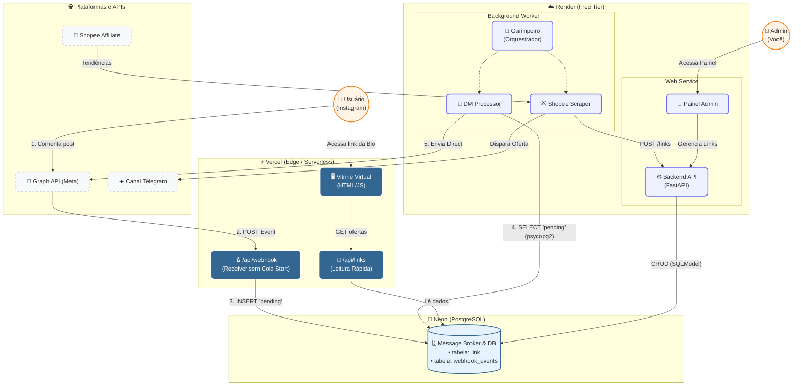

# 🛍️ Achadinhos do Momento (Engine)

O **Achadinhos-Engine** é um sistema completo de automação para curadoria, postagem e gestão de ofertas e links de afiliados (Shopee e Mercado Livre). Ele engloba um bot autônomo (Garimpeiro) para Telegram, uma vitrine web ultrarrápida, disparo automático de mensagens diretas (DMs) no Instagram via Webhooks, e uma ferramenta gráfica para organização de vídeos curtos.

## 🚀 Principais Recursos

- **Garimpeiro Automático (Telegram):** Busca as melhores ofertas da API da Shopee, filtra por qualidade (avaliação e número de vendas), detecta bugs de preço e publica automaticamente no Telegram.
    
- **Vitrine Web (Frontend):** Interface moderna e responsiva para exibir as ofertas aos usuários. Hospedada na Vercel com integrações _Serverless_ para contornar problemas de _cold-start_ e melhorar o tempo de resposta.
    
- **Automação de Instagram (Meta Webhooks):** Responde automaticamente com o link do produto na DM de usuários que comentam palavras-chave específicas (ex: "EU QUERO") nas postagens.
    
- **Video Organizer:** Utilitário desktop com interface gráfica (GUI) em CustomTkinter para organizar, renomear em lote e gerar arquivos de fila (CSV) para publicação de vídeos nas redes sociais.
    
- **Painel Admin:** Interface web protegida para gestão manual de links, visualização de cliques e métricas do sistema em tempo real.
    

## 🏗️ Arquitetura do Sistema

O sistema é distribuído em microsserviços e funções serverless para garantir alta disponibilidade, baixo custo e zero perda de eventos do Instagram.



**Resumo do Fluxo:**

1. A **Meta (Instagram)** envia eventos para a **Vercel API** (Serverless), que é rápida e não sofre _cold-start_, salvando o comentário no **Banco de Dados (Fila)**.
    
2. O **DM Processor** (rodando junto com o Bot) consome a fila do banco de dados e dispara a mensagem no Direct do usuário via Graph API.
    
3. O **Garimpeiro** vasculha a **Shopee**, publica no **Telegram** e registra o produto no **FastAPI**, que o disponibiliza na **Vitrine Web**.
    

## 📂 Estrutura do Projeto

```
achadinhos-engine/
├── backend/            # API FastAPI para gestão, admin e controle central (Deploy: Render)
├── bot-telegram/       # Bot Garimpeiro e DM Processor (Deploy: Máquina Virtual / Render Worker)
├── frontend/           # Vitrine (HTML/JS) e Serverless Functions em Python (Deploy: Vercel)
├── video-organizer/    # App Desktop (CustomTkinter) para organizar lotes de vídeos
├── shared/             # Código compartilhado entre módulos (ex: matching de keywords)
└── .env.example        # Template de variáveis de ambiente
```

## ⚙️ Instalação e Configuração

### 1. Pré-requisitos

- Python 3.10 ou superior
    
- PostgreSQL (Recomendado: Neon, Supabase ou Render)
    
- Conta de Desenvolvedor da Meta (Para Webhooks)
    
- Conta Shopee Affiliate
    
- Bot no Telegram (via BotFather)
    

### 2. Clonando o Repositório e Configurando o Ambiente

```
git clone [https://github.com/seu-usuario/achadinhos-engine.git](https://github.com/seu-usuario/achadinhos-engine.git)
cd achadinhos-engine

# Copie o arquivo de exemplo de variáveis de ambiente
cp .env.example .env
```

_Abra o arquivo `.env` e preencha as credenciais do banco de dados, tokens das APIs (Shopee, Telegram, Meta) e as chaves de segurança._

### 3. Rodando o Backend (FastAPI)

O backend é responsável pelo painel de admin e pelo registro de cliques.

```
cd backend
python -m venv venv
source venv/bin/activate  # ou venv\Scripts\activate no Windows
pip install -r requirements.txt
uvicorn main:app --reload --port 8000
```

_Acesse o admin em: `http://localhost:8000/admin`_

### 4. Rodando o Bot (Garimpeiro)

O bot deve rodar em um processo contínuo (em background ou em um worker no Render/AWS).

```
cd bot-telegram
python -m venv venv
source venv/bin/activate
pip install -r requirements.txt
python main.py
```

### 5. Rodando a Vitrine Web (Frontend)

Para rodar localmente a vitrine HTML de forma estática, você pode usar um servidor simples:

```
cd frontend
python -m http.server 5500
```

_Acesse a vitrine em: `http://localhost:5500`_

## 🛠️ Uso das Ferramentas

### 📹 Video Organizer (GUI Desktop)

Ferramenta para organizar vídeos baixados, renomeá-los em lotes e prepará-los para postagem (Reels/TikTok).

1. Navegue até a pasta: `cd video-organizer`
    
2. Instale as dependências: `pip install -r requirements.txt customtkinter`
    
3. Execute a interface: `python gui_organizer.py`
    
4. **Opcional (Apenas Windows):** Execute `build.bat` para compilar a ferramenta e gerar um arquivo `.exe` executável standalone.
    

### 🤖 Painel de Administração

- Pode ser acessado através da URL principal do seu backend adicionando `/admin` (ex: `https://sua-api.onrender.com/admin`).
    
- Insira a `ADMIN_SECRET` configurada no `.env` para gerenciar links manualmente, checar status do banco, DMs enviadas e webhooks ativos.
    

## 🌐 Opções de Deploy

- **Frontend & Webhooks (Serverless):** Otimizado para deploy na **Vercel**. O arquivo `frontend/api/vercel.json` já está configurado para expor os scripts em Python como Serverless Functions.
    
- **Backend (FastAPI):** Otimizado para **Render** (usando o arquivo `render.yaml`).
    
- **Bot Telegram:** Pode ser rodado como um _Background Worker_ no Render, num servidor VPS, ou no Heroku.
    

## 📜 Licença

Distribuído sob a licença MIT. Veja `LICENSE` para mais informações.